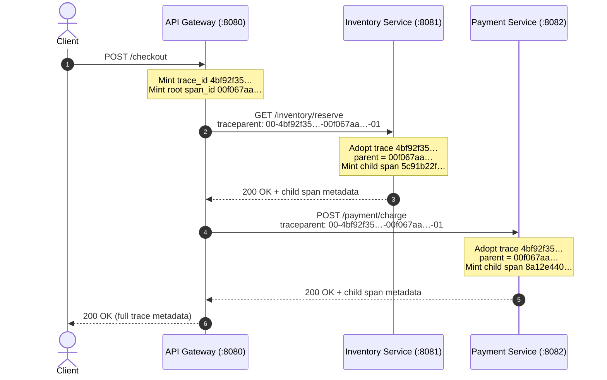

# Technical Architecture & Pedagogical Specification: The SRE Game Day Lab
## "The Midnight Ticketmaster Launch" Microservice Chaos Environment

**Document Status:** Complete Architectural & Technical Specification — validated against the running implementation
**Target Systems:** Distributed Systems, Site Reliability Engineering (SRE), Telemetry Infrastructure
**Lab Repository:** `labs/week1-midnight-launch/`
**Last validated:** 2026-08-30 — see `docs/audits/week1-lab-validation.md`

> **Reading order.** Part I answers *what problem this solves and why*. Part II answers
> *how it is built*. The student-facing runbook is `labs/week1-midnight-launch/README.md`;
> this document is the instructor/peer-review artifact and is the source of truth when the
> two disagree.
>
> **Every numeric claim in this document was measured against the running stack.** Values
> that come from theory rather than measurement are labelled *predicted*. Two open
> curriculum decisions are flagged in §11 — they are not defects in the code.

---

# PART I: CONCEPTUAL FOUNDATIONS & PROBLEM STATEMENT

# 1. Executive Summary

This specification defines the technical architecture, mathematical foundations, and implementation design for **The Midnight Launch SRE Game Day Lab**.

Students operate an 8-container microservice and telemetry system under real-time synthetic traffic surges, inject deterministic production failure modes via a Chaos CLI, observe metrics in Grafana and searchable logs in Kibana, and implement code-level remediations in Python microservices.

The lab's organising claim is that reliability engineering is **empirical, not theoretical**: queueing physics, tail amplification, and cardinality explosions are things you *watch happen to a system you are responsible for*, not formulas you memorise.

```text
┌─────────────────────────────────────────────────────────────────────────────────┐
│                          GAME DAY LAB SYSTEM TOPOLOGY                           │
│                                                                                 │
│  [ Chaos CLI ] ──(Open-Loop Traffic Surge / Chaos)──┐                           │
│                                                     ▼                           │
│  [ Client Requests ] ──► [ API Gateway (:8080) ] ──┬──► [ Inventory Svc (:8081) ]│
│                                  │                 ├──► [ Payment Svc (:8082) ] │
│                                  │                 └──► [ Fan-Out × N legs ]    │
│                                  ▼                                              │
│                        [ Prometheus (:9090) ] ──► [ Grafana War Room (:3000) ]  │
└─────────────────────────────────────────────────────────────────────────────────┘
```

---

# 2. Problem Statement & Pedagogical Gaps

## 2.1 The Failure of Traditional SRE & Observability Pedagogy

Traditional curricula teach observability using static slide decks or trivial code snippets. Three pedagogical flaws follow:

1. **The "Passive Dashboard" Illusion:** Students view screenshots of Grafana graphs without experiencing the ambiguity or non-linear dynamics of an active incident. A graph you cannot *change* teaches nothing about causation.
2. **The "Print Statement" Fallacy:** Microservices are presented as isolated single-thread functions. Students never see why `print("error")` fails at scale, or how trace context survives a network RPC boundary.
3. **Mathematical Abstraction Separation:** Little's Law, Kingman's equation and Dean/Barroso tail amplification are taught in queueing-theory courses, detached from the thread-pool exhaustion and row-lock contention that actually produce them.

## 2.2 The Control Theory & Observability Gap

In 1960, Rudolf E. Kálmán defined observability in linear control theory as the ability to reconstruct internal state from external outputs alone:

$$\dot{\mathbf{x}}(t) = \mathbf{A}\mathbf{x}(t) + \mathbf{B}\mathbf{u}(t), \quad \mathbf{y}(t) = \mathbf{C}\mathbf{x}(t) + \mathbf{D}\mathbf{u}(t)$$

$$\text{Observability Matrix: } \mathbf{O} = \begin{bmatrix} \mathbf{C} \\ \mathbf{C}\mathbf{A} \\ \vdots \\ \mathbf{C}\mathbf{A}^{n-1} \end{bmatrix}, \quad \text{rank}(\mathbf{O}) = n$$

Mapped onto microservices:

- Internal state $\mathbf{x}(t)$ = worker-thread queues, connection-pool waiters, DB locks, memory buffers.
- Observed output $\mathbf{y}(t)$ = HTTP status codes and latency.
- When services emit a bare `HTTP 500` with no trace context and no percentiles, $\text{rank}(\mathbf{O}) < n$: the system is **unobservable**, because several distinct internal failures produce byte-identical external output.

**This is the lab's central thesis.** Every failure mode in §4 is a state that looks the same from outside until you add the right signal. Mission 2 is the purest form: a DB row-lock and a third-party rate limit both surface as "checkout is slow", and only the USE-lens saturation gauge separates them.

---

# 3. Core Objectives

## 3.1 Pedagogical Objectives

1. **Differentiate Monitoring vs. Observability** — move from pre-scripted "known unknowns" (a CPU threshold alert) to investigating novel "unknown unknowns" with high-cardinality telemetry.
2. **Master Telemetry Framework Selection** — apply Tom Wilkie's **RED** (Rate, Errors, Duration) to request-driven services and Brendan Gregg's **USE** (Utilization, Saturation, Errors) to resources, and articulate why each is the wrong lens for the other's job.
3. **Understand Latency Queueing Physics** — experience non-linear P99 growth as utilization $\rho \to 1.0$, and derive required concurrency from $L = \lambda W$.
4. **Practise Resilience Engineering** — implement and tune circuit breakers, load shedding, and bounded metric tag schemas.

> **Scope note.** Real User Monitoring (RUM) and frontend Web Vitals are **out of scope** for
> this lab — there is no browser client in the topology. If RUM is a learning outcome for the
> module it needs a separate frontend artifact; it is deliberately not claimed here.

## 3.2 Technical & Operational Objectives

- **Zero Manual Configuration:** `docker compose up -d --build` provisions the services, Prometheus scraping, the Grafana datasource, and the dashboard. No clicking.
- **Python-Native Codebase:** Python 3.11 (FastAPI, Uvicorn, `prometheus_client`) — readable enough that students edit it in Exercise 1 and 2.
- **Deterministic Chaos Engineering:** every failure mode is a single idempotent CLI command, and `reset` returns the system to baseline.
- **Honest Instrumentation:** the lab must never report a number it did not measure. Where the client cannot achieve its target load, it says so (§4.1) rather than quietly lowering the target.

## 3.3 How We Intend To Achieve This

| Objective | Mechanism | Where it lives |
| :--- | :--- | :--- |
| Make failure *felt*, not described | Live 5-container system + real HTTP under real load | `docker-compose.yml`, `services/` |
| Make failure *reproducible* | Idempotent chaos endpoints + `reset` | `chaos-cli/chaos.py`, `/chaos/*` |
| Make failure *legible* | RED + USE panels, 1s scrape, 1s refresh | `telemetry/` |
| Make theory *falsifiable* | Panels plot **observed vs predicted** side by side | Panels 7 & 8 (§8.3) |
| Make remediation *concrete* | Students edit the same source they just watched fail | Exercises, §10 |

The fourth row is the design's distinguishing move: the dashboard does not merely display
metrics, it displays the *theory's prediction next to the measurement*, so a student can see
the model hold — or fail — in real time.

---

# 4. Mathematical Failure Models & Chaos Injection Mechanics

## 4.1 Failure Mode 1: Traffic Surge (Little's Law & Open-Loop Kingman Queueing)

### Mathematical Principle

**Little's Law ($L = \lambda W$):** concurrency is not a tunable — it is imposed on you.
At $\lambda = 100\text{ r/s}$ with $W = 100\text{ms}$, in-flight concurrency $L = 10$.
Hold $W$ and raise $\lambda$ to $10{,}000\text{ r/s}$ and you need $L = 1{,}000$ workers.
*(Arithmetic illustration — see the measured ceiling note below.)*

**Kingman's approximation:**

$$W_q \approx \left( \frac{\rho}{1 - \rho} \right) \left( \frac{C_a^2 + C_s^2}{2} \right) \tau$$

As $\rho = \frac{\lambda}{\mu} \to 1.0$, the term $\frac{\rho}{1-\rho}$ diverges. Latency does not degrade linearly with load; it hits a knee and goes vertical.

### Open-Loop vs. Closed-Loop Load Generation

This is an architectural decision with pedagogical consequences.

A **closed-loop** generator (submit $N$, block for $N$ responses, repeat) silently reduces its own arrival rate $\lambda$ when the server slows. It cannot observe queueing, because it stops offering load at exactly the moment queueing begins — the instrument destroys the phenomenon it measures.

`chaos.py` implements a true **open-loop** generator:

- Requests dispatch on a wall-clock schedule: `target = min(total, int(elapsed * rps) + 1)`.
- `threading.local()` gives each worker its own `requests.Session()` — `Session` is not documented thread-safe, and sharing one corrupts connection state under load.
- A **bounded drain** (`--drain`, default 20s) stops the client hanging forever on a saturated server; still-queued requests are reported as `abandoned` rather than silently dropped.
- **Achieved RPS is measured and printed.** A gap between target and achieved is a *finding* — the system refusing offered load — not a broken tool.

> **Measured ceiling (2026-08-30).** At `--rps 300 --duration 10` on a developer laptop the
> generator achieved **298 RPS (99%)**. Worker threads are capped at 600
> (`min(max(50, rps), 600)`), so `--rps 10000` will not land — it will report a large
> target/achieved gap. Use $\lambda \le 300$ for clean Little's Law demonstrations and treat
> higher values as saturation experiments.

### Chaos Trigger
```bash
python3 chaos-cli/chaos.py load --rps 300 --duration 30 --drain 20
```

---

## 4.2 Failure Mode 2: Database Row-Lock Contention (Bimodal Latency & Bucket Alignment)

### Mathematical Principle

Cache misses force row-level lock acquisition, producing a **bimodal latency distribution** — the arithmetic mean describes neither mode and therefore describes nothing:

| Mode | Component latency | Measured end-to-end `/checkout` |
| :--- | :--- | :--- |
| Fast path (cache hit) | inventory hop **23ms**, payment hop **27ms** | **64–73ms** |
| Slow path (row lock) | inventory hop **3,000ms** injected | **~3,030–3,070ms** |

> The often-quoted "cache hit = 15ms" is the *inventory service's own* simulated work
> (`random.uniform(0.005, 0.025)`, mean 15ms). The figure a student sees on the gateway RED
> panel is the full end-to-end request: **~70ms baseline**, because the payment call and
> gateway overhead are on the path too.

### Latency Bucket Alignment

Histogram buckets: `[0.005, 0.01, 0.025, 0.05, 0.1, 0.25, 0.5, 1.0, 2.0, 3.0, 3.5, 5.0, 10.0]`

`histogram_quantile()` interpolates *within* a bucket, so a coarse bucket next to the signal produces a badly wrong percentile. The original bucket set jumped `2.5 → 5.0`, straddling the 3s lock and yielding a meaningless P99.

The `3.0` boundary brackets the injected delay and **`3.5` is the bucket that actually captures the observation**, because the real request is the 3s lock *plus* the payment call plus queueing. Verified: with the lock active, all sampled requests land in `le=3.5` and **zero** below `le=3.0`.

**Measured:** `p99 = 3,495 ms` against a true request time of 3.03–3.07s. That is tight and correctly bracketed — but it is *not* exact, because interpolation still occurs inside `(3.0, 3.5]`. Documentation must say "≈3,000–3,500ms", never "exactly 3,000ms".

### Chaos Trigger
```bash
python3 chaos-cli/chaos.py db-lock --delay 3.0
```
Under lock the inventory service also returns `HTTP 504` on 15% of requests (simulated deadlock timeout), so students see latency *and* errors move together.

---

## 4.3 Failure Mode 3: Third-Party Rate Limit Shedding

### Operational Principle

External payment processors protect themselves under surge traffic by shedding load. This teaches that **your error budget can be consumed entirely by a dependency you do not own and cannot fix.**

The mock emits `HTTP 429 Too Many Requests` on a configurable fraction of charges (default 0.40). The gateway propagates the status, so the 429s surface on the gateway's RED error-rate panel.

> Implementation note: only `429` is emitted. Earlier drafts of this spec also claimed `500`;
> that is not implemented. If a hard-failure variant is wanted it is a one-line addition to
> `payment-service/main.py`.

### Chaos Trigger
```bash
python3 chaos-cli/chaos.py rate-limit --error-rate 0.40
```

---

## 4.4 Failure Mode 4: Tail Latency Fan-Out & Circuit Breaker State Machine

### Mathematical Principle (Dean & Barroso)

If the gateway invokes $N$ parallel dependencies and **waits for all of them**, each with independent tail probability $p$:

$$P(\text{System Slow}) = 1 - (1 - p)^N$$

| $N$ | Predicted $P$ at $p=0.01$ |
| :--- | :--- |
| 1 | 1.0% |
| 10 | 9.6% |
| 25 | **22.2%** (≈1 request in 4.5) |

The lesson: **fan-out converts a rare tail event into the common case.** A dependency's P99 becomes the system's P78.

### Empirical Verification (this is the point of the design)

The gateway exports `gateway_fanout_requests_total` and `gateway_fanout_slow_total`; their ratio is the *observed* $P(\text{slow})$, plotted on Panel 8 directly against the *predicted* curve $1-(0.99^N)$.

**Measured 2026-08-30**, $N=25$, $p=0.01$, 300 requests:

```
predicted 22.2%   observed 23.0% (69/300)   95% CI ±4.7%
```

Also verified across the curve at $p=0.05$: $N{=}1 \to 5.0\%$ observed vs 5.0% predicted; $N{=}10 \to 48.3\%$ vs 40.1%; $N{=}25 \to 76.7\%$ vs 72.3% (deviations within binomial noise at $n=60$).

### Circuit Breaker State Machine

`CLOSED (0)` → `OPEN (1)` → `HALF-OPEN (2)` → `CLOSED (0)`

- **`CLOSED`** — normal operation; a success resets `failure_count`.
- **`OPEN`** — entered after `failure_threshold` (5) failures. Requests fail fast with `HTTP 503` without touching the network.
- **`HALF-OPEN`** — entered **automatically** after `recovery_timeout_seconds` (10s). Probe traffic is admitted; `half_open_required` (2) consecutive successes close the breaker. A single failed probe re-opens it immediately.

State transitions are guarded by `_CB_LOCK` (`threading.Lock`) because FastAPI serves sync endpoints on a thread pool, so `/checkout` handlers race.

> **Teaching caveat.** `HALF-OPEN` is *transient*: against a healthy backend the breaker
> closes after 2 successes, so students watching a 1s-refresh dashboard will often see
> `OPEN → CLOSED` and miss the intermediate state. Verified: forcing `--state OPEN` on a
> healthy backend yields `503` at t=0 and `CLOSED` by t=11s. The gauge is correct; the state
> is simply short-lived. Teach the trip from real failures (README Mission 5), not from
> `--state OPEN`, which is a demo shortcut that skips the mechanism being taught.

### Chaos Triggers
```bash
python3 chaos-cli/chaos.py fanout --n 25 --probability 0.01
python3 chaos-cli/chaos.py circuit-breaker --state CLOSED   # then let it trip
```

---

## 4.5 Failure Mode 5: TSDB Cardinality Bomb & Memory Management

### Mathematical & Memory Principle

Prometheus active series count is the **product** of distinct label values:

$$C = N_{\text{metrics}} \times \prod_{i=1}^{k} V_i$$

Bounded labels multiply to a constant (`service × endpoint × status` = tens of series). One unbounded label — `user_id`, `request_id`, `email` — makes $C$ grow with *traffic*, and each series costs in-memory index. This is the precise mechanism that makes metrics the wrong tool for high-cardinality debugging, and it is why traces and wide events exist.

### Implementation Precision

- Distinct user IDs are tracked in `CARDINALITY_SEEN_USERS` (guarded by `_CARDINALITY_LOCK`), so the gauge reports **true distinct series**, not request count. A repeat hit on an already-seen `user_id` adds zero series — an earlier implementation incremented per request, which is a slope, not an explosion.
- **Measured:** 400 requests → 400 distinct series, gauge `412` (= base 12 + 400).
- On reset, `CARDINALITY_BOMB_COUNTER.clear()` unregisters the label children, genuinely freeing the leaked footprint rather than merely resetting the display. Verified: gauge returns to `12.0`, label children to `0`.

### Chaos Trigger
```bash
python3 chaos-cli/chaos.py cardinality-bomb
```

---

# PART II: ARCHITECTURE, TOOLING ECOSYSTEM & IMPLEMENTATION DEEP DIVE

# 5. Tools & Stack Ecosystem

| Technology | Category | Purpose & role in lab |
| :--- | :--- | :--- |
| Python 3.11 | Language | Readable implementation students edit directly |
| FastAPI 0.109 | ASGI framework | Services + HTTP middleware hook for RED metrics |
| Uvicorn 0.27 | ASGI server | Runs the services; its thread pool *is* the saturation surface |
| `prometheus-client` 0.19 | Telemetry SDK | Counter / Histogram / Gauge primitives |
| `requests` 2.31 | HTTP client | Downstream RPCs + Chaos CLI |
| Prometheus v2.48 | Time-series DB | 1s scrape, PromQL evaluation |
| Grafana v10.2 | Visualization | Auto-provisioned War Room dashboard |
| Docker Compose v2 | Orchestration | 5-container bridge network, healthcheck gating |
| `ThreadPoolExecutor` | Concurrency | Open-loop load generation + parallel fan-out legs |

> **W3C Trace Context is implemented directly, with no OpenTelemetry SDK dependency.**
> Earlier drafts listed `opentelemetry-api` / `opentelemetry-sdk` in the tooling table and in
> `requirements.txt`; they were declared but never imported, so they were removed. The
> ~20 lines of `child_span()` in each service (§6.1) are deliberately transparent: students
> read the actual header parsing rather than trusting an SDK. **Adopting the real SDK is a
> live curriculum decision — see §11.**

---

# 6. Microservices & Distributed Tracing Architecture

## 6.1 W3C Trace Context Parent-Child Span Propagation

Header format: `traceparent: 00-{trace_id}-{span_id}-{flags}` (32-hex trace, 16-hex span).

1. **API Gateway (root span)** mints a 128-bit `trace_id` and 64-bit `span_id`.
2. **Inventory / Payment (child spans)** parse the incoming header, **adopt** the `trace_id`, record the caller's `span_id` as `parent_span_id`, and **mint a new** `span_id`.

Step 2 is the part that is easy to get wrong and was wrong in an earlier build: reusing the parent's span-id across hops yields a trace with no causal structure — a flat list that cannot be rendered as a waterfall.

**Verified:** one `/checkout` returns a single shared `trace_id`, three *distinct* span-ids, and both children carrying the gateway's span as `parent_span_id`.



Inventory and Payment are **siblings**, not a chain: both are children of the gateway span, which is what a parallel fan-out actually looks like.

## 6.2 Service Responsibilities & Metric Catalog

### API Gateway (`:8080`) — `services/api-gateway/main.py`
Ingress, downstream orchestration, RED metrics, circuit breaker, fan-out, cardinality bomb.

| Metric | Type | Meaning |
| :--- | :--- | :--- |
| `http_requests_total{method,route,status}` | Counter | RED: Rate + Errors |
| `http_request_duration_seconds{...}` | Histogram | RED: Duration (buckets §4.2) |
| `gateway_active_workers` | Gauge | Little's Law observed $L$ |
| `circuit_breaker_state` | Gauge | 0=CLOSED, 1=OPEN, 2=HALF-OPEN |
| `tsdb_cardinality_series_count` | Gauge | Distinct simulated series (base 12) |
| `gateway_fanout_requests_total` | Counter | Checkouts that fanned out |
| `gateway_fanout_slow_total` | Counter | Checkouts with ≥1 slow leg |
| `gateway_fanout_dependencies` | Gauge | Configured $N$ |
| `http_requests_user_tagged_total{route,user_id}` | Counter | **The bomb** — unbounded label |

### Inventory Service (`:8081`)
Ticket reservation, row-lock simulation, and the fan-out dependency leg.

| Metric | Type | Meaning |
| :--- | :--- | :--- |
| `inventory_requests_total{...}` | Counter | Rate + Errors |
| `inventory_request_duration_seconds{...}` | Histogram | Duration |
| `postgres_connection_pool_waiters` | Gauge | **USE: Saturation** — the panel that localises Mission 2 |

`/dependency/call` is one fan-out leg: it independently hits its tail with probability `tail_probability`, which is what makes $P(\text{slow})$ compound with $N$.

### Payment Service (`:8082`)
Third-party gateway mock; rate-limit shedding.

| Metric | Type | Meaning |
| :--- | :--- | :--- |
| `payment_requests_total{...}` | Counter | Rate + Errors |
| `payment_request_duration_seconds{...}` | Histogram | Duration |

## 6.3 Concurrency Model & Why It Saturates

FastAPI runs **sync** `def` endpoints on an `anyio` worker thread pool (default 40). Blocking `time.sleep()` and blocking `requests` calls therefore occupy real threads. That is deliberate: thread-pool exhaustion is the saturation surface students observe, and it is what makes `gateway_active_workers` a meaningful $L$.

Fan-out legs execute in a **separate** `ThreadPoolExecutor(max_workers=128)` so they cannot starve the pool serving `/checkout` itself.

## 6.4 Middleware & Metric Hygiene

The RED middleware **skips** `/metrics`, `/health`, and any `/chaos*` path. Instructor chaos commands are control-plane traffic; counting them would pollute the very rate and error panels students are asked to read. Verified: six chaos calls leave `http_requests_total` series count unchanged.

---

# 7. Telemetry Pipeline & Zero-Config Provisioning

This section is load-bearing. Two defects here previously prevented the lab from starting at all (`docs/audits/week1-lab-validation.md`, Blockers 1 & 2).

## 7.1 Prometheus (`telemetry/prometheus/prometheus.yml`)

```yaml
global:
  scrape_interval: 1s        # aggressive on purpose: classroom feedback latency
  evaluation_interval: 1s

scrape_configs:
  - job_name: 'api-gateway'
    static_configs: [{ targets: ['api-gateway:8080'] }]
  - job_name: 'inventory-service'
    static_configs: [{ targets: ['inventory-service:8081'] }]
  - job_name: 'payment-service'
    static_configs: [{ targets: ['payment-service:8082'] }]
```

Dashboard rate windows are `[15s]`/`[30s]`, not `[5s]`: a range must span several scrape intervals for `rate()` to be stable.

## 7.2 Grafana Datasource — the `uid` contract

```yaml
datasources:
  - name: Prometheus
    uid: prometheus          # ← MUST be pinned
    type: prometheus
    url: http://prometheus:9090
    isDefault: true
```

**Why this matters:** without an explicit `uid`, Grafana generates a random one (observed: `PBFA97CFB590B2093`). Every dashboard panel that hardcodes a `uid` then fails with *"Data source not found"* — the dashboard provisions successfully and every panel is empty. The dashboard JSON references `uid: "prometheus"` on all 12 targets; the two values must match exactly.

## 7.3 Grafana Dashboard Provider

```yaml
providers:
  - name: 'SRE War Room Dashboards'
    type: file
    options:
      path: /var/lib/grafana/dashboards   # a DIRECTORY, outside the provisioning tree
```

## 7.4 Container Mount Contract (Compose)

```yaml
volumes:
  - ./telemetry/grafana/provisioning/datasources:/etc/grafana/provisioning/datasources
  - ./telemetry/grafana/provisioning/dashboards:/etc/grafana/provisioning/dashboards
  - ./telemetry/grafana/dashboards:/var/lib/grafana/dashboards
environment:
  - GF_DASHBOARDS_MIN_REFRESH_INTERVAL=1s
```

> **All three mount targets must be distinct.** Mounting two host directories onto the same
> container path makes the Docker daemon refuse the container outright:
> `Error response from daemon: Duplicate mount point: /etc/grafana/provisioning/dashboards`.
> Grafana never starts, and the lab's zero-config promise fails at step one.
>
> `GF_DASHBOARDS_MIN_REFRESH_INTERVAL=1s` is required because Grafana otherwise clamps
> provisioned dashboards to a 5s floor and logs
> *"Changing refresh interval for provisioned dashboard to minimum refresh interval"* —
> silently overriding the 1s the dashboard requests.

## 7.5 Startup Ordering

All three Python services declare a `healthcheck`, and the gateway declares
`depends_on: { condition: service_healthy }`. Without this the gateway can accept traffic
before its downstreams bind, producing spurious connection errors in the first seconds of a
class.

---

# 8. The SRE War Room Dashboard

## 8.1 Panel Inventory

| # | Panel | Lens |
| :--- | :--- | :--- |
| 1 | Incoming Request Rate | RED: Rate |
| 2 | Error Rate % | RED: Errors |
| 3 | Latency Percentiles (P50/P99) | RED: Duration |
| 4 | DB Connection Pool Saturation | **USE: Saturation** |
| 5 | Circuit Breaker State | Resilience |
| 6 | TSDB Active Series Count | Cardinality |
| 7 | Little's Law — observed vs predicted $L$ | Queueing |
| 8 | Tail Amplification — observed vs $1-(1-p)^N$ | Fan-out |

## 8.2 Core PromQL

```promql
# Rate
sum(rate(http_requests_total{job="api-gateway"}[15s]))

# Error % (clamp_min guards divide-by-zero at idle)
sum(rate(http_requests_total{job="api-gateway", status=~"5..|429"}[15s]))
  / clamp_min(sum(rate(http_requests_total{job="api-gateway"}[15s])), 0.001) * 100

# P99 latency in ms
histogram_quantile(0.99,
  sum(rate(http_request_duration_seconds_bucket{job="api-gateway"}[30s])) by (le)) * 1000
```

## 8.3 The Theory-vs-Measurement Panels

Panels 7 and 8 are the design's core pedagogical instrument — they plot the model's prediction against live measurement.

```promql
# Panel 7 — Little's Law: predicted L = λ × W
sum(rate(http_requests_total{job="api-gateway"}[30s]))
  * histogram_quantile(0.50, sum(rate(http_request_duration_seconds_bucket{job="api-gateway"}[30s])) by (le))
# ...plotted against the measured gateway_active_workers

# Panel 8 — Dean & Barroso: observed vs predicted
sum(rate(gateway_fanout_slow_total[30s])) / clamp_min(sum(rate(gateway_fanout_requests_total[30s])), 0.001)
1 - (0.99 ^ gateway_fanout_dependencies)
```

> **PromQL has no `pow()` function.** Exponentiation is the `^` operator. `pow(0.99, N)`
> returns `HTTP 400 Bad Request` and the panel renders empty.

---

# 9. Chaos API Reference

Every chaos operation is an idempotent HTTP endpoint; the CLI is a thin wrapper, so instructors can `curl` directly.

| Service | Endpoint | Parameters | Effect |
| :--- | :--- | :--- | :--- |
| Gateway | `GET /chaos/status` | — | Dump live chaos state |
| Gateway | `POST /chaos/cardinality` | `active` | Toggle unbounded `user_id` label |
| Gateway | `POST /chaos/circuit-breaker` | `enabled`, `state` | Enable breaker / force a state |
| Gateway | `POST /chaos/fanout` | `n` (0–100) | Set parallel dependency count $N$ |
| Gateway | `POST /chaos/reset` | — | Clear all, **including downstreams** |
| Inventory | `POST /chaos/db-lock` | `locked`, `delay` | Inject row-lock latency |
| Inventory | `POST /chaos/tail` | `probability`, `delay` | Per-dependency tail probability $p$ |
| Payment | `POST /chaos/rate-limit` | `active`, `error_rate` | Fraction shed as `429` |

CLI surface:
```
status | reset | load | db-lock | rate-limit | cardinality-bomb | circuit-breaker | fanout
```

---

# 10. Student Exercises & Evaluation Rubric

## 10.1 Exercises

1. **Adaptive Load Shedding** — add middleware on `ACTIVE_WORKERS`; shed with `HTTP 429` above 50 in-flight. Teaches that shedding load beats collapsing under it.
2. **TSDB Cardinality Bug Fix** — replace the unbounded `user_id` label with a bounded enumeration (`user_type="standard"|"vip"`), then verify series stability. Teaches bounded tag schema design.

## 10.2 Quantitative Grading Rubric (100 Points)

| Category | Weight | Evaluation Criteria |
| :--- | :---: | :--- |
| **Telemetry Diagnosis** | 35 | Correctly identifies incident root cause from RED/USE dashboards — notably distinguishing DB-lock latency from third-party rate limiting. |
| **Code Remediation** | 35 | Implements load-shedding middleware and fixes the cardinality tag bug. |
| **Mathematical Analysis** | 30 | Computes Little's Law concurrency ($L=\lambda W$) and tail failure probability $1-(1-p)^N$; compares predicted vs observed from Panels 7 and 8. |

> ⚠ **Rubric changed from earlier drafts.** The "Mathematical Analysis" criterion previously
> required students to compute **error budget burn rates**. The lab implements no SLO, no
> error budget, and no burn-rate metric — the graded task was unperformable. It has been
> restated in terms of quantities the lab actually produces. **See §11.1: restoring error
> budgets is a live curriculum decision.**

---

# 11. Open Decisions (Require Instructor Ruling)

These are not defects. They are choices the code cannot make.

## 11.1 Error Budgets & SLOs — currently absent
Weeks 1 and 9 both touch SRE practice, and the original assessment framing assumed error-budget arithmetic. Options:

- **(a) Implement** — add an SLO target, an error-budget gauge, and a burn-rate panel. Roughly one new gauge plus two PromQL panels; the error-rate signal already exists. Restores the original rubric.
- **(b) Defer to Week 9** — keep Week 1 on queueing/tail/cardinality and teach error budgets properly alongside SRE practice later. The rubric as written in §10.2 already reflects this option.

*Current state: (b).*

## 11.2 OpenTelemetry SDK — currently hand-rolled
- **(a) Keep hand-rolled** — ~20 transparent lines per service; students read real header parsing; zero dependency weight. Loses: no exporter, no collector, no auto-instrumentation.
- **(b) Adopt the SDK** — industry-realistic, gives a real trace backend (Jaeger/Tempo) and a genuine waterfall UI. Costs: a 6th container, more magic, more setup surface.

*Current state: (a). §5 has been corrected to describe (a) accurately.*

## 11.3 Service Count: 3 services vs 1 — **decided 2026-08-30: keep 3**

Instructor raised the alternative of a single service doing everything. Reviewed and kept at three, but the reasoning is recorded here because the question will recur.

**Why three survives:** each downstream produces a *distinct failure signature*, and telling them apart is the skill being assessed (Rubric §10.2, "Telemetry Diagnosis", 35 pts). Measured on the live stack:

| Broken component | Status codes | Latency |
| :--- | :--- | :--- |
| baseline | all `200` | ~60ms |
| inventory (owned dependency) | all `200` | **3,050ms** |
| payment (third party) | **`429`s** | ~65ms — still fast |

Signatures share no overlap. Collapse them into one service and "checkout is broken" has a single signature — there is an alert to read, but no diagnosis to perform. This is §2.2's $\text{rank}(\mathbf{O}) < n$ made physical.

Two further capabilities require a process boundary and cannot be simulated in-process: **W3C trace propagation** across a real network hop (§6.1), and **parallel fan-out** to N dependencies (§4.4).

**Merit in the single-service view:** fewer moving parts, faster boot, less code to read. Note the current cost is already modest — ~400 lines of service code total, 5 containers, seconds to boot.

**Reversal cost if revisited:** low. The three services share one middleware pattern; merging is mostly deletion. What would be *lost* is the diagnosis exercise and the trace/fan-out demos, not the queueing or cardinality lessons — those work in a monolith.

*A monolith variant would actually make a good deliberate contrast artifact ("same fault, now tell me which subsystem") — noted, not scoped.*

## 11.4 Load Ceiling
The generator tops out near 300 RPS on a laptop. If missions need genuinely high $\lambda$, the realistic paths are lowering per-request work or running the generator from a second machine — not raising `--rps` and hoping.

---

# 12. Verification & Quickstart

```bash
# 1. Enter the lab
cd labs/week1-midnight-launch/

# 2. Build and launch (Compose v2 required: `docker compose version` must work)
docker compose up -d --build

# 3. Confirm health — all three services must report (healthy)
docker compose ps

# 4. Open the War Room
#    http://localhost:3000   admin / admin

# 5. Drills
python3 chaos-cli/chaos.py status
python3 chaos-cli/chaos.py load --rps 300 --duration 30
python3 chaos-cli/chaos.py db-lock --delay 3.0
python3 chaos-cli/chaos.py rate-limit --error-rate 0.40
python3 chaos-cli/chaos.py fanout --n 25 --probability 0.01
python3 chaos-cli/chaos.py cardinality-bomb
python3 chaos-cli/chaos.py circuit-breaker --state CLOSED
python3 chaos-cli/chaos.py reset
```

## 12.1 Validation Status

Last full end-to-end validation **2026-08-30**: clean rebuild, 5/5 containers, **14/14 regression checks passed**, all 12 dashboard panel targets returning `status: success` through the Grafana datasource proxy, and all 12 README commands exiting 0. Full evidence, including the 14 defects found and fixed, is in `docs/audits/week1-lab-validation.md`.

# 13. 2026-08-31 Modularization, Expanded Dashboard, and Log Pipeline

The three service entrypoints now contain only the ASGI import. Each service is split into a package with a composition root, routes, state, telemetry, tracing, and structured logging; the gateway additionally isolates downstream clients and the circuit-breaker state machine. This preserves the public HTTP and Prometheus contracts while making each mechanism independently readable.

The Grafana war room expands from 8 to 16 metrics panels. The added views correspond to the supplied operations-dashboard references: service health, per-route incoming throughput, 4XX/5XX responses, outgoing dependency throughput/failures/P99, and Python runtime CPU/resident memory. JVM and goroutine views were deliberately not copied because this lab runs Python; displaying them would fabricate signals the runtime does not produce.

The log path is:

```text
FastAPI ECS-shaped JSON stdout
    -> Docker json-file log
        -> Filebeat 8.15 autodiscovery + JSON decode
            -> Elasticsearch 8.15 daily midnight-launch-logs-* index
                -> Kibana 8.15 Discover (`midnight-launch-logs-*` data view)
```

Elasticsearch runs as a single-node classroom service with authentication disabled, and Kibana is its dedicated log-exploration UI. Grafana remains metrics-only. This is intentionally local-only and must not be treated as a production security pattern. The complete stack now requires materially more disk and RAM than the original five-container metrics-only stack.

**Verification status:** the modular application images build and the three-service checkout path was re-run successfully with distinct spans, new outbound client metrics, process metrics, and correlated JSON logs. Compose, dashboard JSON, and telemetry YAML parse successfully. Full eight-container verification remains pending on the authoring machine because pulling the Elastic images filled its 47 GB root filesystem; see the current session handoff rather than misreading the 2026-08-30 five-container validation above as evidence for this extension.

---
*End of Architectural Specification.*
